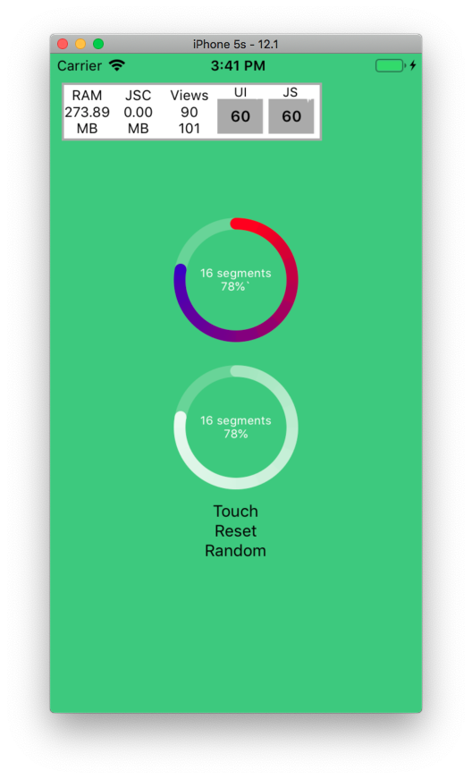

# react-native-conical-gradient-progress

Attempt on implementing conical gradient for `react-native-circular-progress` (see https://github.com/bgryszko/react-native-circular-progress/issues/41
https://github.com/fdnhkj/react-native-conical-gradient)

## Description
- Can accept external Props `size,
  width,
  fill,
  prefill,
  beginColor,
  endColor,
  segments,
  backgroundColor`
- Migrated to `expo`
- Migrated to `react-native-svg`
- Used multiple paths and different linear gradients to implement the conical gradient

## Todo
- [ ] Customize component
- [ ] Some performance tricks
- [x] Accept Component Props
- [x] Move to Expo 

## Status

## References
- https://github.com/bgryszko/react-native-circular
- http://jsfiddle.net/Cy7ec/3/
- https://github.com/fdnhkj/react-native-conical-gradient
